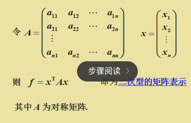
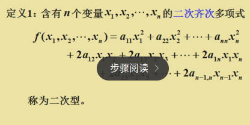
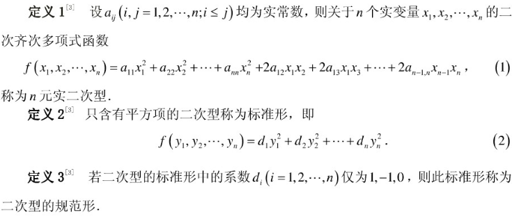
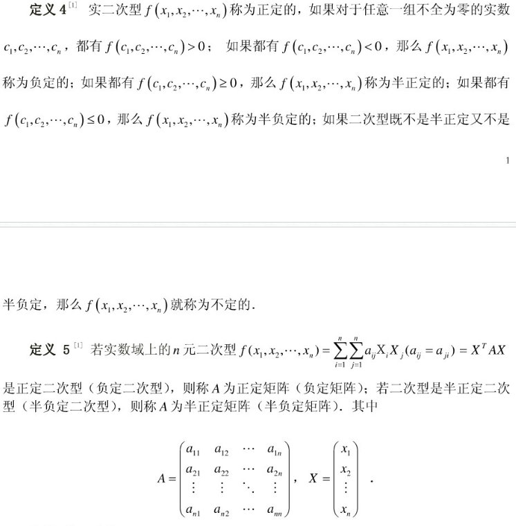
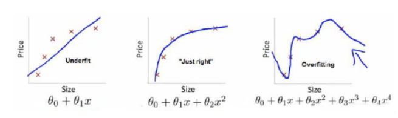
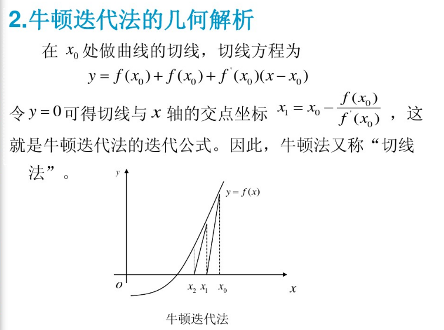
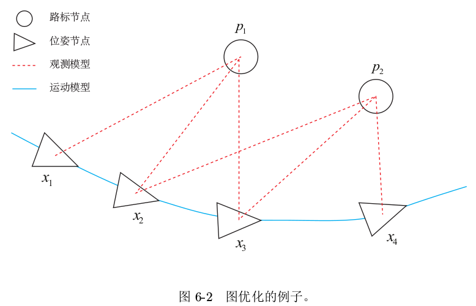

最优化问题和非线性优化学习笔记all_in_one
===

[TOC]

# 1. 好文章记录
  http://blog.sina.com.cn/s/blog_7445c2940102x3x4.html

# 2. 阅读相关领域公式的基础符号
## 2.1. 这个J就是最小二乘
下面公式的latex由mathpix识别自动生成,这个软件超级赞

 $  \begin{aligned} J \left( a _ { 1 } , a _ { 2 } , \cdots a _ { m } \right) & = \sum _ { i = 1 } ^ { n } \delta _ { i } ^ { 2 } = \sum _ { i = 1 } ^ { n } \left[ f \left( x _ { i } \right) - y _ { i } \right] ^ { 2 } \\ & = \sum _ { i = 1 } ^ { n } \left[ \sum _ { k = 1 } ^ { m } a _ { k } r _ { k } \left( x _ { i } \right) - y _ { i } \right] ^ { 2 } \end{aligned}  $ 

# 3. 基础概念(包括数学,优化理论和机器学习领域)
## 3.1. 数学
### 3.1.1. 线性和非线性
  线性:直线函数就是所指的线性
  非线性:高次模型(平方,或者指数之类的)就是非线性了

### 3.1.2. 超定方程组
方程个数大于未知量个数的方程组,一般是不存在解的矛盾方程组,如果有向量a使得
 $  \sum _ { i = 1 } ^ { n } \left( r _ { i 1 } a _ { 1 } + r _ { i 2 } a _ { 2 } + \cdots + r _ { i m } a _ { m } - y _ { i } \right) ^ { 2 }  $ 达到最小,则称a为上述超定方程组的最小二乘解
超定方程组如下:
n > m
 $  \left\{ \begin{array} { l } { r _ { 11 } a _ { 1 } + r _ { 12 } a _ { 2 } + \cdots + r _ { 1 m } a _ { m } = y _ { 1 } } \\ { \cdots \cdots } \\ { r _ { n 1 } a _ { 1 } + r _ { n 2 } a _ { 2 } + \cdots + r _ { n m } a _ { m } = y _ { n } } \end{array} \right.  $ 

### 3.1.3. 回归分析
  为什么叫回归,就是通过对数据统计,回到归到模型,就是统计出来一个模型

#### 3.1.3.1. 线性回归
  就是线性方程的统计回归,一元线性回归和多元线性回归,就是自变量1个和多个差别
  一元线性回归也叫直线线性回归
   $ \hat { y } _ { i } = a + b x _ { i } $ 
  多元线性回归如下
   $ \hat { y } _ { i } = b _ { 0 } + b _ { 1 } x _ { 1 i } + b _ { 2 } x _ { 2 i } + \cdots + b _ { n } x _ { n i } $ 

#### 3.1.3.2. 求回归方程(就是求模型函数)的方法
  散点图
  奇异点
  最小二乘法 lease square
  残差平方和

### 3.1.4. 二次型

  

### 3.1.5. 正定,半正定,负定,半负定
  [正定矩阵的性质和判定方法及应用](https://wenku.baidu.com/view/988c45424b7302768e9951e79b89680203d86b9a.html?rec_flag=default&sxts=1550989413044)

  结合上面的二次型概念一起理解

  
### 3.1.6. 奇异矩阵
  奇异矩阵是线性代数的概念，就是对应的行列式等于0的矩阵。
  奇异矩阵的判断方法：首先，看这个矩阵是不是方阵（即行数和列数相等的矩阵。若行数和列数不相等，那就谈不上奇异矩阵和非奇异矩阵）。 然后，再看此方阵的行列式|A|是否等于0，若等于0，称矩阵A为奇异矩阵；若不等于0，称矩阵A为非奇异矩阵。 同时，由|A|≠0可知矩阵A可逆，这样可以得出另外一个重要结论:可逆矩阵就是非奇异矩阵，非奇异矩阵也是可逆矩阵。
  所以半正定矩阵属于 奇异矩阵和正定矩阵两种情况的描述

### 3.1.7. 病态系统 矩阵
  现在有线性系统： Ax = b， 解方程
   $ \left[ \begin{array} { c c } { 400 } & { - 201 } \\ { - 800 } & { 401 } \end{array} \right] \left[ \begin{array} { l } { x _ { 1 } } \\ { x _ { 2 } } \end{array} \right] = \left[ \begin{array} { c } { 200 } \\ { - 200 } \end{array} \right] $ 

  很容易得到解为： x1 = -100, x2 = -200. 如果在样本采集时存在一个微小的误差，比如，将 A 矩阵的系数 400 改变成 401：
   $ \left[ \begin{array} { c c } { 401 } & { - 201 } \\ { - 800 } & { 401 } \end{array} \right] \left[ \begin{array} { l } { x _ { 1 } } \\ { x _ { 2 } } \end{array} \right] = \left[ \begin{array} { c } { 200 } \\ { - 200 } \end{array} \right] $ 

  则得到一个截然不同的解： x1 = 40000, x2 = 79800.
  当解集 x 对 A 和 b 的系数高度敏感，那么这样的方程组就是病态的 (ill-conditioned).

## 3.2. 数值优化
### 3.2.1. 核函数
   $ \begin{array} { l l } { \min _ { x } } & { \frac { 1 } { 2 } \sum _ { i } \rho _ { i } \left( \left\| f _ { i } \left( x _ { i _ { 1 } } , \ldots x _ { i _ { n } } \right) \right\| ^ { 2 } \right) } \\ { \text {s.t.} } & { l _ { j } \leq x _ { j } \leq u _ { j } } \end{array} $ 
  在上面这个目标函数中,由许多平方项经过**核函数** $ \rho ( \cdot ) $ 之后,求和组成
### 3.2.2. 误差项
  如上式所示, $ f _ { i } $ 为**代价函数**(cost function),在slam中,亦可以理解为误差项

## 3.3. 机器学习
### 3.3.1. 损失函数(代价函数),风险函数,目标函数
#### 3.3.1.1. 损失函数

  和代价函数是一个概念
  

  上面三个图的函数依次为  $ f_{1}(x) $  ,  $ f_{2}(x) $  ,  $ f_{3}(x) $  。我们是想用这三个函数分别来拟合Price，Price的真实值记为  $ Y $  。

  我们给定  $ x $  ，这三个函数都会输出一个  $ f ( X ) $  ,这个输出的  $ f ( X ) $  与真实值  $ Y $  可能是相同的，也可能是不同的，为了表示我们拟合的好坏，我们就用一个函数来度量拟合的程度，比如：
   $ L ( Y , f ( X ) ) = ( Y - f ( X ) ) ^ { 2 } $ 
  这个函数就称为损失函数(loss function)，或者叫代价函数(cost function)。损失函数越小，就代表模型拟合的越好,其实是最小二乘度量,二乘结果最小,表示效果最好

#### 3.3.1.2. 风险函数

  那是不是我们的目标就只是让loss function越小越好呢？还不是。这个时候还有一个概念叫风险函数(risk function)。风险函数是损失函数的期望，这是由于我们输入输出的  遵循一个联合分布，但是这个联合分布是未知的，所以无法计算。但是我们是有历史数据的，就是我们的训练集，  关于训练集的平均损失称作经验风险(empirical risk)，即  $ \frac { 1 } { N } \sum _ { i = 1 } ^ { N } L \left( y _ { i } , f \left( x _ { i } \right) \right) $  ，所以我们的目标就是最小化  ，称为经验风险最小化 $ \frac { 1 } { N } \sum _ { i = 1 } ^ { N } L \left( y _ { i } , f \left( x _ { i } \right) \right) $ 。

#### 3.3.1.3. 过拟合
  如果到这一步就完了的话，那我们看上面的图，那肯定是最右面的 f_3(x) 的经验风险函数最小了，因为它对历史的数据拟合的最好嘛。但是我们从图上来看 f_3(x)肯定不是最好的，因为它过度学习历史数据，导致它在真正预测时效果会很不好，这种情况称为过拟合(over-fitting)
#### 3.3.1.4. 模型复杂度
  为什么会造成这种结果？大白话说就是它的函数太复杂了，都有四次方了，这就引出了下面的概念，我们不仅要让经验风险最小化，还要让结构风险最小化。这个时候就定义了一个函数  ，这个函数专门用来度量模型的复杂度，在机器学习中也叫正则化(regularization)。常用的有  $ L _ { 1 } $  ,  $ L _ { 2 } $  范数。
#### 3.3.1.5. 目标函数
  到这一步我们就可以说我们最终的优化函数是： $ \min \frac { 1 } { N } \sum _ { i = 1 } ^ { N } L \left( y _ { i } , f \left( x _ { i } \right) \right) + \lambda J ( f ) $  ，即最优化经验风险和结构风险，而这个函数就被称为目标函数。

# 4. 非线性方程求解

## 4.1. 牛顿迭代法学习
https://wenku.baidu.com/view/ddac681fc281e53a5902ff05.html
https://wenku.baidu.com/view/f1c7095a02d8ce2f0066f5335a8102d276a261f7.html?rec_flag=default&sxts=1550972743718

### 4.1.1. 算法原理理解

  牛顿迭代法(Newton method)又称为牛顿-拉夫逊方法(Newton-Rapfson method)，它是牛顿在17世纪提出的一种在实数域和复数域上近似求解方程的方法.多数方程不存在求根公式，因此求精确根非常困难甚至不可能，从而寻找方程的近似根就显得特别重要

  牛顿迭代法目的是寻找f(x) = 0的根,但是又有可能不存在精确根,所以就选择曲线和x轴交点附近的一个x0作为迭代起点,逐次逼近真实的f(x) = 0的根
  如下图所示

  如下公式是f(x)在x0处的泰勒展开
   $ f ( x ) = f \left( x _ { 0 } \right) + f \left( x - x _ { 0 } \right) f ^ { \prime } \left( x _ { 0 } \right) + \left( x - x _ { 0 } \right) ^ { 2 } \frac { f ^ { \prime \prime } \left( x _ { 0 } \right) } { 2 ! } + \cdots  $ 
  取其线性部分作为非线性方程 的近似方程，则有
   $  f \left( x _ { 0 } \right) + f ^ { \prime } \left( x _ { 0 } \right) \left( x - x _ { 0 } \right) = 0  $ 

# 5. 数值优化和非线性优化
  https://www.cnblogs.com/Jessica-jie/p/7153014.html

  牛顿法可以用来逼近求解问题,自然可以逼近求解最值问题,
  然后最小二乘或者高斯牛顿方法和牛顿迭代法是什么关系呢?那么增量 $ \Delta \boldsymbol { x } _ { k } $ 如何确定?就需要用到数值优化方法了,有三种方法:
  1. 一阶和二阶梯度法 (要求可导)
  2. 高斯牛顿法 (要求可导)
  3. 列文伯格-马夸尔特方法（Levenberg-Marquadt法）(要求可导)

  **注** 
  1. 梯度下降法和牛顿法可以用于任何可导函数的优化
  2. 梯度下降法值保留泰勒展开的一阶项（只有雅克比项,二阶梯度则保存H），牛顿法保留到二阶项（有海森矩阵项）
## 5.1. 梯度下降法
  一阶为梯度下降,二阶梯度就是牛顿法了

  一阶梯度下降法 就是找到函数下降的方向
  为了求使目标函数最小的  $  \Delta x  $ ，我们对 $  \Delta x  $ 求导，然后试图求得使倒数为0的那个 $  \Delta x  $ 。

  1. 对于一阶的梯度下降法，求导后是线性方程，所以没有极小值，所以只用求得的\Delta x的方向。
  2. 对于二阶的牛顿法，求导后是二阶方程，所以能够求得一个极小值。

## 5.2. 高斯牛顿法

  高斯牛顿法解决非线性最小二乘问题的最基本方法，并且它只能处理二次函数(使用时必须将目标函数转化为二次的)
### 5.2.1. 高斯牛顿法理解
   $ f ( x ) $ 一阶展开如下所示:
   $ f ( \boldsymbol { x } + \Delta \boldsymbol { x } ) \approx f ( \boldsymbol { x } ) + \boldsymbol { J } ( \boldsymbol { x } ) \Delta \boldsymbol { x } $ 
  这里 $ J ( x ) $ 为 $ f ( x ) $ 关于 $  x  $ 的导数，实际上是一个m×n的矩阵，也是一个雅克比矩阵.
  现在要求下降矢量 $ \Delta x $ ，使得 $ \| f ( x + \Delta x ) \| $  达到最小,为求 $ \Delta x $ ，我们需要解一个线性的最小二乘问题：
   $ \Delta \boldsymbol { x } ^ { * } = \arg \min _ { \Delta \boldsymbol { x } } \frac { 1 } { 2 } \| f ( \boldsymbol { x } ) + \boldsymbol { J } ( \boldsymbol { x } ) \Delta \boldsymbol { x } \| ^ { 2 } $ 
  问题来了?如何理解为什么使得 $ \| f ( x + \Delta x ) \| $  达到最小,就需要求 $ \Delta x $ 的最小二乘问题呢?
  右上角的星号表示解的意思
  因为是多元多维度自变量,那么一个 $ \Delta x $ 会出现各个偏导数情况下都会出现增量, $ f ( x ) $ 在x处的泰勒展开,只要 $ \Delta x $ 足够小,那么 $ f ( \boldsymbol { x } + \Delta \boldsymbol { x } ) $ 就等同于 $ f ( \boldsymbol { x } ) + \boldsymbol { J } ( \boldsymbol { x } ) \Delta \boldsymbol { x } $ ,而此时为了求得 $ \| f ( x + \Delta x ) \| $  达到最小,那么就是找 $ \frac { 1 } { 2 } \| f ( \boldsymbol { x } ) + \boldsymbol { J } ( \boldsymbol { x } ) \Delta \boldsymbol { x } \| ^ { 2 } $ 最小, $ \frac { 1 } { 2 } \| f ( \boldsymbol { x } ) + \boldsymbol { J } ( \boldsymbol { x } ) \Delta \boldsymbol { x } \| ^ { 2 } $ 找最小就是最小二乘问题了
  有了这个假设,我们就可以捋清楚,要求
   $ \| f ( x + \Delta x ) \| $ 最小,那么
  ->   $ \Delta \boldsymbol { x } ^ { * } = \arg \min _ { \Delta \boldsymbol { x } } \frac { 1 } { 2 } \| f ( \boldsymbol { x } ) + \boldsymbol { J } ( \boldsymbol { x } ) \Delta \boldsymbol { x } \| ^ { 2 } $ 最小,那么自然就会针对这个求导了
  ->  $ \begin{aligned} \frac { 1 } { 2 } \| f ( \boldsymbol { x } ) + \boldsymbol { J } ( \boldsymbol { x } ) \Delta \boldsymbol { x } \| ^ { 2 } & = \frac { 1 } { 2 } ( f ( \boldsymbol { x } ) + \boldsymbol { J } ( \boldsymbol { x } ) \Delta \boldsymbol { x } ) ^ { T } ( f ( \boldsymbol { x } ) + \boldsymbol { J } ( \boldsymbol { x } ) \Delta \boldsymbol { x } ) \\ & = \frac { 1 } { 2 } \left( \| f ( \boldsymbol { x } ) \| _ { 2 } ^ { 2 } + 2 f ( \boldsymbol { x } ) ^ { T } \boldsymbol { J } ( \boldsymbol { x } ) \Delta \boldsymbol { x } + \Delta \boldsymbol { x } ^ { T } \boldsymbol { J } ( \boldsymbol { x } ) ^ { T } \boldsymbol { J } ( \boldsymbol { x } ) \Delta \boldsymbol { x } \right) \end{aligned} $ 
  ->  $ J ( x ) ^ { T } J ( x ) \Delta x = - J ( x ) ^ { T } f ( x ) $  得到了这个等式了
  再依据如下四个步骤:
  1. 给定初始值 $ x _ { 0 } $ .
  2. 对于第  $  k  $  次迭代,求出当前的雅克比矩阵 $ \boldsymbol { J } \left( \boldsymbol { x } _ { k } \right) $  和误差 $ f \left( \boldsymbol { x } _ { k } \right) $ (这个为啥叫误差,看上面的基础知识)
  3. 求增量方程  $ \boldsymbol { H } \Delta \boldsymbol { x } _ { k } = \boldsymbol { g } $  ,就可以得到 $ \Delta x _ { k } $ 
  4. 得到了 $ \Delta x _ { k } $  再判断,若  $ \Delta x _ { k } $  足够小,则停止.否则,令 $ \boldsymbol { x } _ { k + 1 } = \boldsymbol { x } _ { k } + \Delta \boldsymbol { x } _ { k } $ ,返回第二步.

  接下来,如何理解高翔博士所说的几个缺陷
  1. 要求我们所用的近似 $  H  $ 矩阵是可逆的（而且是正定的）,但实际数据中计算得到的JTJ却只有半正定性
    解答:因为我们假设 用 $ \mathrm { J } ( \mathrm { x } ) \mathrm { TJ } ( \mathrm { x } ) $ 代替 $  H  $ ,所以需要H是可逆矩阵,

  2. 在使用Gauss Newton方法时，可能出现JTJ为奇异矩阵或者病态（ill-condition）的情况，此时增量的稳定性较差，导致算法不收敛
  3. 步长 $ \Delta x $ 太大，也会导致我们采用的局部近似（1）不够准确，这样一来我们甚至都无法保证它的迭代收敛，哪怕是让目标函数变得更大都是可能的
  4. Levenberg-Marquadt方法加入了α，在△x确定了之后又找到了α，从而||f(x+α△x)||2达到最小，而不是直接令α=1

## 5.3. 列文伯格-马夸尔特方法（Levenberg-Marquadt法）
  相比高斯牛顿,增加了信赖区域
  由于Gauss-Newton方法中采用的近似二阶泰勒展开只能在展开点附近有较好的近似效果，所以我们很自然地想到应该给△x添加一个信赖区域（Trust Region），不能让它太大而使得近似不准确。非线性优化中有一系列这类方法，这类方法也被称之为信赖区域方法（Trust Region Method）。在信赖区域里边，我们认为近似是有效的；出了这个区域，近似可能会出问题。

## 5.4. 图优化
  利用图模型,来表述非线性优化问题,这个真是太伟大的映射了!
  图优化,是把优化问题表现成图(Graph)的一种方式。这里的图是图论意义上的图。一个图由若干个顶点(Vertex),以及连接着这些节点的边(Edge)组成。进而,用顶点表示优化变量,用边表示误差项

  我们用三角形表示相机位姿节点,用圆形表示路标点,它们构成了图优化的顶点;同时,蓝色线表示相机的运动模型,红色虚线表示观测模型,它们构成了图优化的边。此时,虽然整个问题的数学形式仍是式(6.12)那样,但现在我们可以直观地看到问题的结构了。如果我们希望,也可以做去掉孤立顶点或优先优化边数较多(或按图论的术语,度数较大)的顶点这样的改进。但是最基本的图优化,是用图模型来表达一个非线性最小二乘的优化问题。而我们可以利用图模型的某些性质,做更好的优化

 $ J ( \boldsymbol { x } ) = \sum _ { k } \boldsymbol { e } _ { v , k } ^ { T } \boldsymbol { R } _ { k } ^ { - 1 } \boldsymbol { e } _ { v , k } + \sum _ { k } \sum _ { j } \boldsymbol { e } _ { y , k , j } ^ { T } \boldsymbol { Q } _ { k , j } ^ { - 1 } \boldsymbol { e } _ { y , k , j } $  (6.12公式)